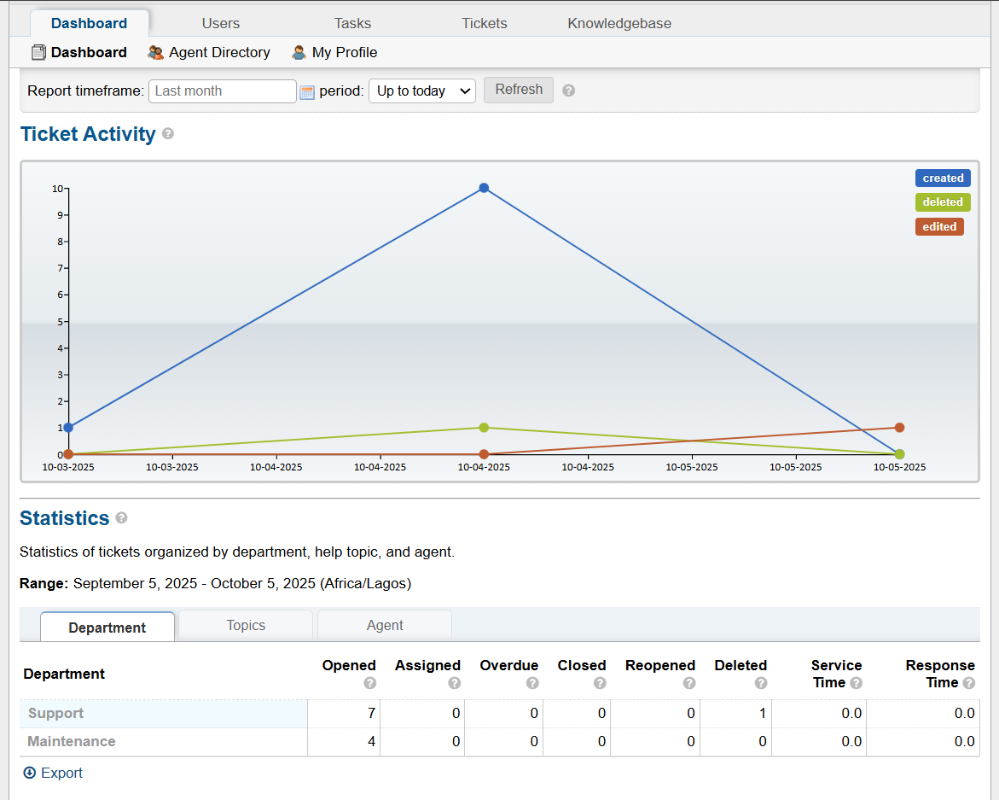

**osTicket Admin Dashboard Insights**

The osTicket admin dashboard is the central interface for managing the helpdesk ticketing system. By analyzing its features, I gained valuable insights into administering and optimizing ticket workflows. This md file outlines how the dashboard’s metrics and visualizations enhanced my understanding of ticketing system management.

**General Overview for Administration:**

The dashboard offered a clear snapshot of all tickets, allowing me to monitor and prioritize tasks efficiently. 

**Smooth Workflow Operations:**

The dashboard’s structure allowed me track the entire ticket lifecycle (from Open to In Progress and to Resolved) and assign tickets to the right department

Ticket Activity Visualization (Bar Chart):A bar chart displayed ticket activity, showing metrics like the number of tickets per status (Open, Assigned, Overdue, Closed, Re-opened, Deleted) over a selectable time range 

Detailed Metrics by Department, Topic, and Agent:
The dashboard organized ticket statistics by: Department, Help Topic, General Inquiry and Agent

Ticket Status Metrics:
The dashboard tracked the following tickets status
Opened Tickets: Newly submitted tickets 
Assigned Tickets: Tickets assigned to agents 
Overdue Tickets: Tickets past it's due dates 
Closed Tickets: Resolved tickets 
Re-opened Tickets: None in my dashboard, but the dashboard would flag these for follow-up.
Deleted Tickets: None deleted, but it is tracked for proper auditing.

Service and Response Time Metrics:

The dashboard showed service time (time from ticket creation to resolution) and response time (time to first admin reply).

**Time Range for Activities:**
The dashboard allowed selecting a time range (for example daily, weekly, monthly) for all ticket activities

**Screenshots of Insights from the Dashboard**    
  

In conclusion, The dashboard is were everything happens and it gave me better and proper insights on how the workflow of the ticketing system
