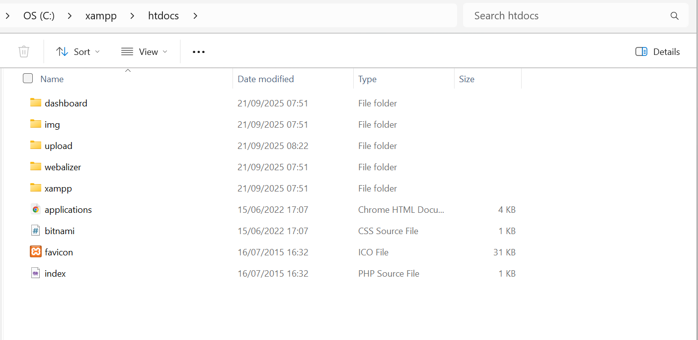
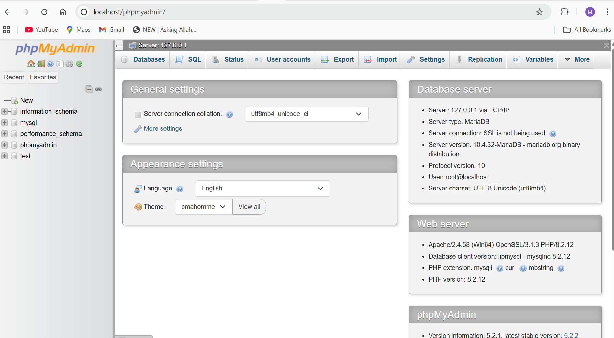

Helpdesk Ticket System with osTicket

Objective: The goal of this project was to simulate real-world IT support workflows by building a helpdesk ticketing system using osTicket. By setting up a local server, configuring the osTicket platform, and managing realistic user tickets, I demonstrated key IT support skills such as system administration, database management, and user issue resolution. This project simulates tasks performed in helpdesk roles, showcasing my ability to troubleshoot technical issues and document processes for a professional portfolio.

Tools set-up for
**osTicket:** Open-source helpdesk ticketing system (v1.18).
**XAMPP:** Local server environment (version 8.2.12, with Apache, MySQL/MariaDB PHP 8.2.12).
**MySQL:** Database management through phpMyAdmin
**Git:** Version control for project documentation

Setup Steps
To create a fully functional osTicket helpdesk system, I followed these steps on a Windows machine:
1.Installed XAMPP:
Downloaded XAMPP 8.2.12 from apachefriends.org

I ran the installer as Administrator and installed to C:\xampp, selecting Apache, MySQL, PHP, and phpMyAdmin.

This was followed up by starting Apache and MySQL in XAMPP Control Panel, confirming both services turned green which signifies running

I tested the setup by accessing it on my localhost at http://localhost:8080 (I ensured to use port 8080 to avoid port 80 conflicts).

2. Set Up osTicket Files:
Downloaded osTicket v1.18 from osticket.com/download.

I extracted the upload folder contents to C:\xampp\htdocs\osticket, ensuring files are directly in the osticket folder.

I copied C:\xampp\htdocs\osticket\include\ost-sampleconfig.php to ost-config.php and set the neccessary permissions:

3. Created MySQL Database and User:
Accessed phpMyAdmin at http://localhost/phpmyadmin.

Created a database named osticket_db

I added a user, configured the username and granted all privileges on the osticket_db to the newly created user

4.Ran osTicket Installer:
I navigated to http://localhost:8080/osticket, then filled in the installer form; which contains information needed to set-up the ticketing system. I also ensured the settings has no conflicts with the database created earlier in phpmyadmin

5. Secured the Installation:
For best security practices, I deleted the C:\xampp\htdocs\osticket\setup folder and set ost-config.php to read-only.

Simulated IT Support Tasks
To mimic real-world IT support scenarios, I created and managed tickets reflecting real-world user submissions, using the osTicket user portal’s Help Topics which includes the Feedback, General Inquiry, Report a Problem, and Access Denied. These scenarios align with common issues in Nigeria’s tech industry.

Challenges Faced  
I encountered several issues, which I resolved to ensure a functional ticket system:

[Persistent MySQL errors] (“MySQL shutdown unexpectedly”) and buffering on localhost

How I resolved it: I reinstalled XAMPP and deleted the corrupted files in C:\xampp then I ensured Apache was not running on port 80 to avoid port conflicts:
netstat -ano | findstr :80
C:\xampp\apache\conf\httpd.conf to change Listen 80 to Listen 8080.

[Not Found” 404 error] at http://localhost/osticket due to incorrect folder structure.

How I resolved it: I moved osTicket files from C:\xampp\htdocs\upload to C:\xampp\htdocs\osticket, ensuring index.php was in the correct directory.

[Configuration file missing!] error for ost-config.php.

Solution: Copied ost-sampleconfig.php to ost-config.php and set write permissions:
Copy-Item -Path C:\xampp\htdocs\osticket\include\ost-sampleconfig.php -Destination C:\xampp\htdocs\osticket\include\ost-config.php

I encountered errors while attempting to push my work from my local machine to my github account due to the particular git account not being authenticated on my current vscode

Solution: I switched from HTTPS to SSH authentication then I generated a new SSH key from my terminal, which was added to the SSH agent, and linked the public key to my GitHub account. After updating my repo’s remote URL to use the SSH format, I tested the connection, and once it authenticated successfully, I was finally able to push my updates without any login or access errors.

Lessons Learned
-Technical Skills: I have gained hands-on experience with server setup (XAMPP, Apache, MySQL), database configuration, and osTicket administration, which is similar to tasks in IT support roles.

-Troubleshooting: Learned to diagnose and resolve server issues (e.g port conflicts) which is key for helpdesk environments.

-Documentation: I have developed a clear, professional documentation to showcase problem-solving for potential employers.

