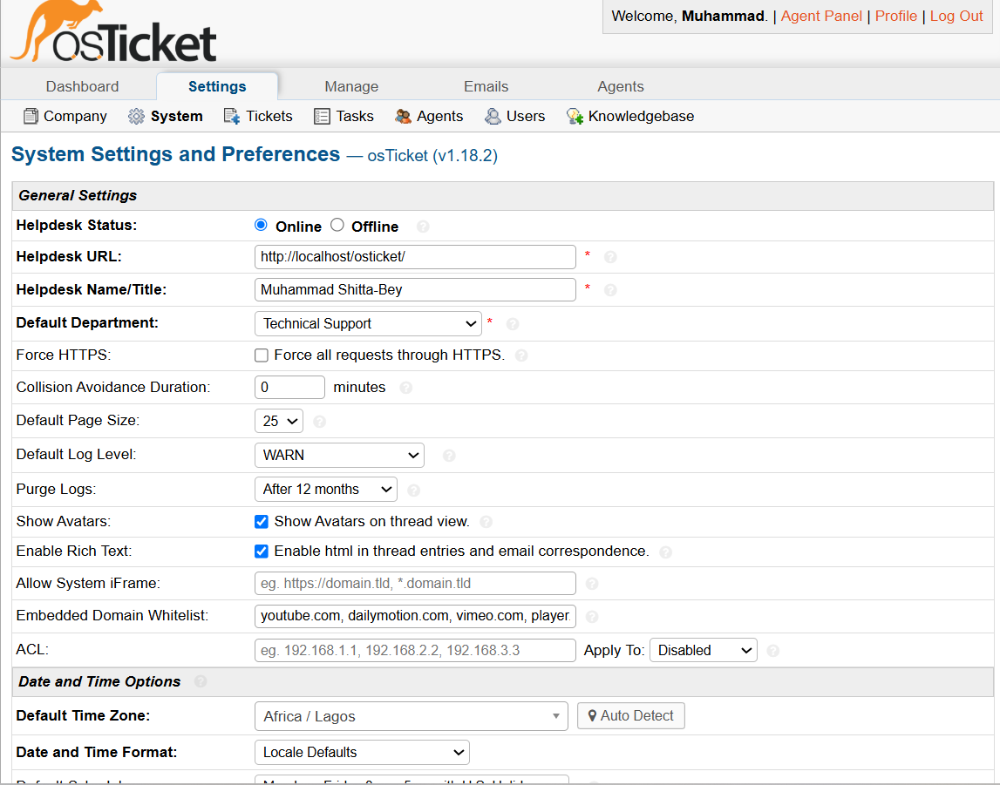
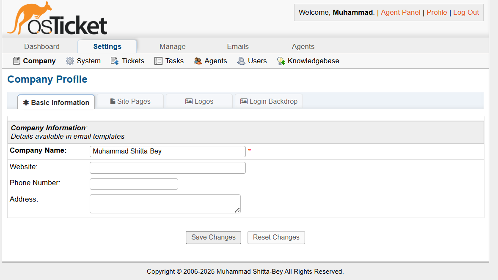
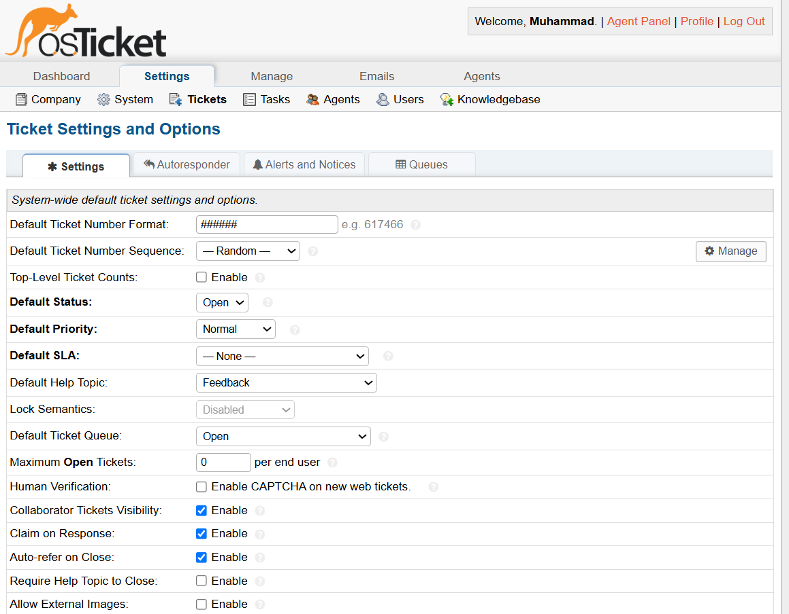
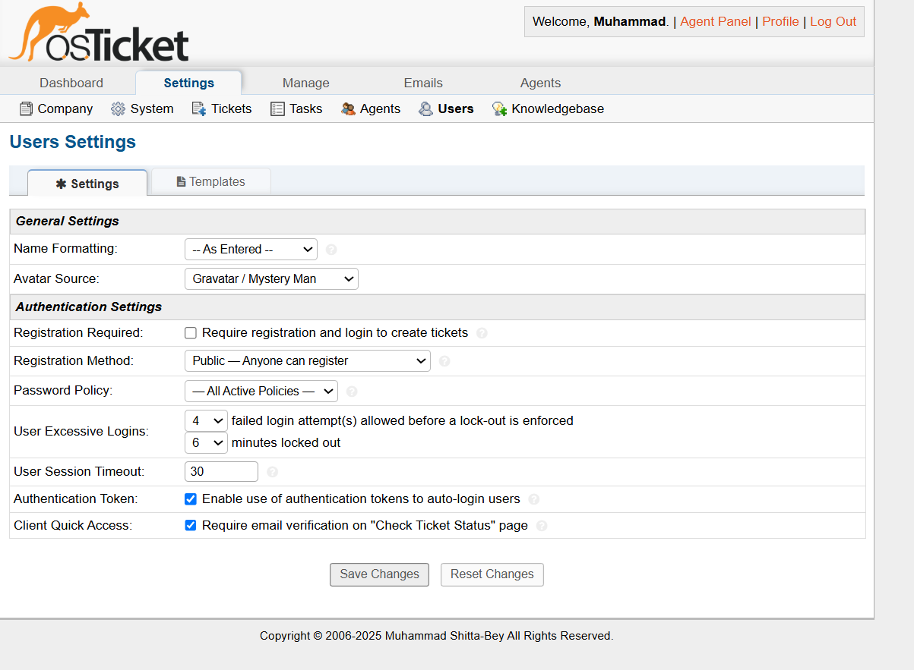
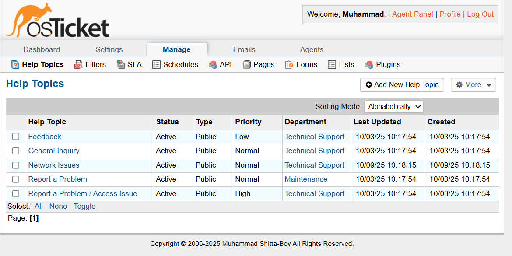
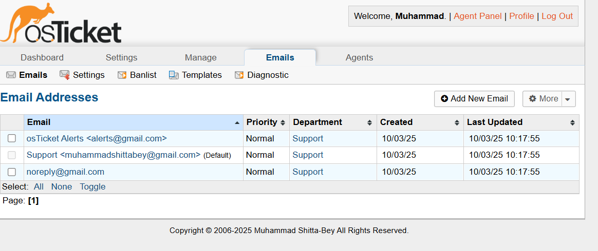

This outlines the configuration of the osTicket admin panel used in setting-up and managing the helpdesk ticketing system. The configurations ensure efficient ticket workflows, user management, and system operations, simulating real-world IT support tasks

1. System Settings and Preferences

Helpdesk Status: Set to Online to allow ticket submissions and Offline option available for maintenance.
Helpdesk URL: Configured to http://localhost:8080/osticket/ 
In addition, I HTTPs enforcement disabled for local setup.
Default Time Zone: Set to GMT+ 1 for Lagos for Nigeria’s time zone.

2. Company Information
Site Pages: Configured default pages for user portal.
Basic Operations: Set company name and default email.

3. Ticket and Settings and Options  
Options: Enabled auto-assignment to agents and set default priority to Normal.
Number Format: Configured ticket numbers with prefix TICKET (e.g TICKET-123).

4. Task Settings and Options
Task Creation: Enabled tasks for tickets 
Task Status: Set statuses (e.g. Open, Completed, resolved) for easier tracking.

5. Agents and Users Settings
Agents: Added IT Support Team as an agent group with full permissions.
Users: Allowed guest users to submit tickets without registration.

6. Manage Section
This consists of the following segments
Help Topics: Feedback, General Inquiry, Report a Problem, Access Denied.
Filters: Set filter to route urgent tickets to IT department.
SLA: Removed the default SLA of 18 hours for a ticket and set a fixed time
Schedules: Left the default business hours set
API: Disabled API for local setup.
Forms: Customized ticket form to include fields: Name, Email, Help Topic, Subject, Description.
Lists: Created list for priority levels based on Low, Medium, High and Urgent.
Plugins: No plugins added for simplicity.

7. Email Settings
Email Settings: Set default email to receive notifications.
Templates: Customized New Ticket template with a fixed response
Diagnostics and Banlist: Added no emails to banlist 

