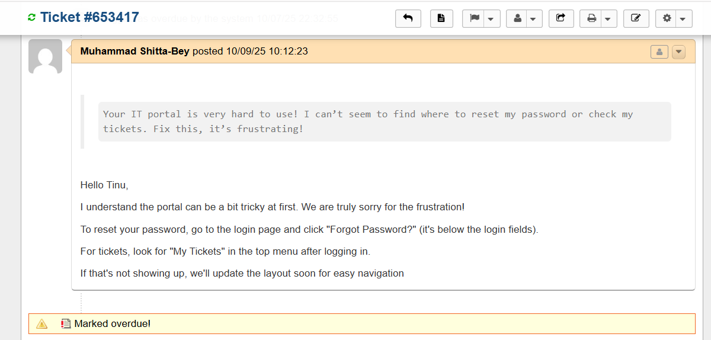
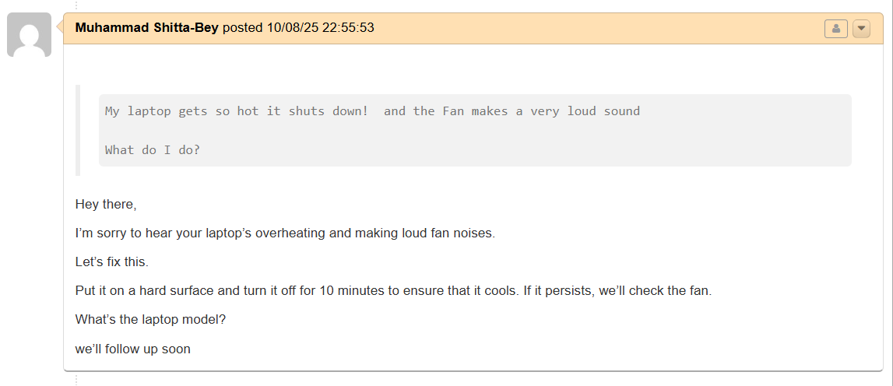
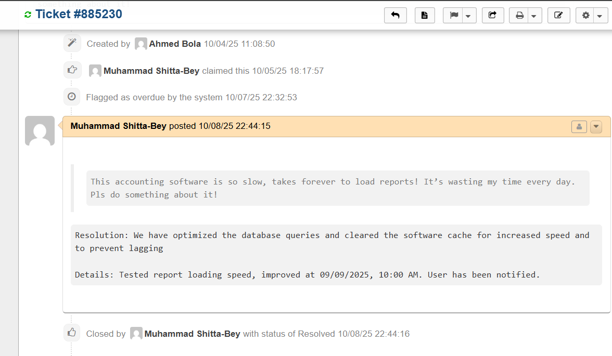
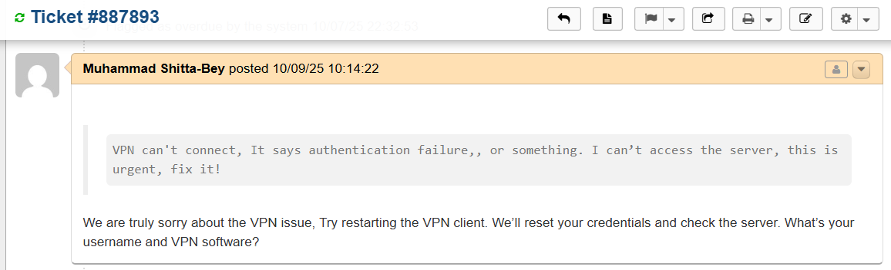
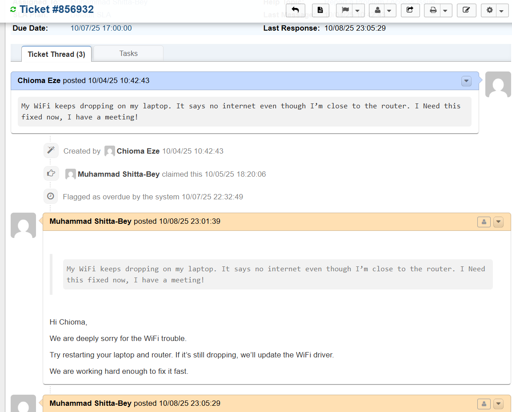

Admin and User Workflow Simulation

This outlines the workflow simulation in the osTicket helpdesk system, showcasing the interaction between user complaints and admin responses. User complaints are submitted through the user portal and Admin responses are handled in the admin panel, where the admin provides solutions to the user. This process simulates real-world IT support workflows.

The following screeshots displays the interaction between the user and the admin:
excel files.png

